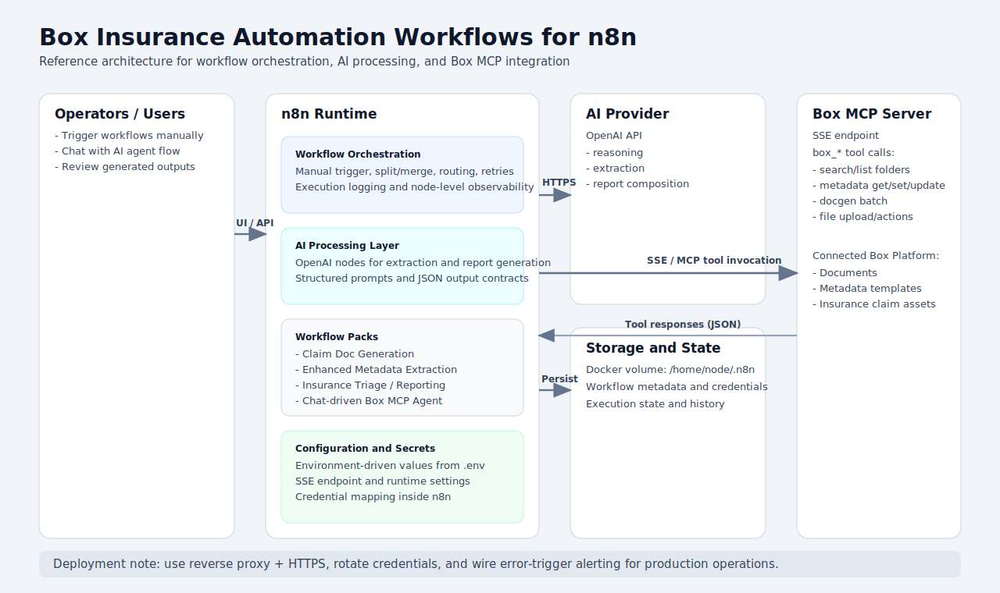
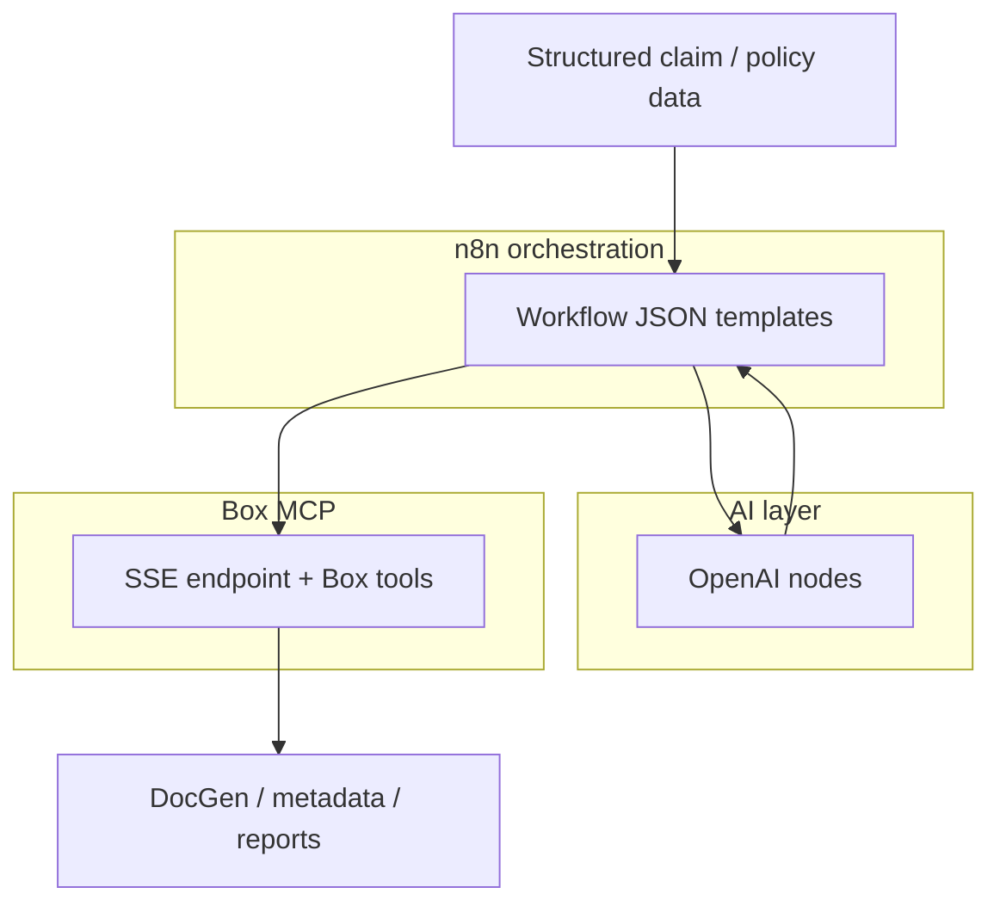

# Box Insurance Automation Workflows for n8n

## Overview

This project provides production-oriented n8n workflow templates for Box MCP automation in insurance operations.  
It includes end-to-end examples for document generation, metadata enrichment, claim report assembly, and agent-assisted Box actions.

## Key Capabilities

- Claim document generation from structured input data
- Enhanced metadata extraction and metadata lifecycle operations
- Insurance claim triage and report composition flows
- Chat-triggered Box MCP agent workflow
- Environment-driven configuration for portable deployments

## Architecture



- **Orchestration:** n8n workflows exported as JSON templates
- **AI Layer:** OpenAI-backed nodes for reasoning and response shaping
- **Content Layer:** Box MCP tools accessed via SSE endpoint
- **Runtime:** Docker Compose with persistent n8n data volume
- **Configuration:** `.env`-based settings for endpoint and runtime values

### Architecture (Mermaid)



## Repository Structure

- `doc-gen-claim-generation/`
  - `Box DocGen Claim Generation.json`
  - `sample-data/sample_claims_data.json`
- `enhanced-metadata-extraction/`
  - `Enhanced Metadata extraction.json`
  - `Delete ACME POLICY Metadata.json`
- `insurance-demo/`
  - `Insurance Demo No agents.json`
- `simple-box-mcp-agent/`
  - `Simple Box MCP Agent.json`
- `docker-compose.yml`
- `.env.example`
- `OPERATIONS.md`

## Quick Start

1. Copy `.env.example` to `.env`.
2. Set secure values for:
   - `N8N_BASIC_AUTH_USER`
   - `N8N_BASIC_AUTH_PASSWORD`
   - `N8N_ENCRYPTION_KEY`
   - `BOX_MCP_SSE_ENDPOINT`
3. Start the stack:

```bash
docker compose up -d
```

4. Open n8n at `http://localhost:5678`.
5. Import workflow JSON files from this repository.
6. Map OpenAI credentials in imported nodes and run test executions.

## Security and Privacy

- No personal machine paths are required for execution.
- Runtime values are environment-driven (`.env`), not hardcoded in docs.
- Keep API keys and credentials out of workflow prompts and source control.
- Rotate credentials regularly and back up n8n encrypted data.

## Deployment Notes

- Use HTTPS and reverse proxy for external access.
- Configure alerting using error trigger workflows.
- Replace sample Box identifiers in prompts with your own resource IDs.
- Follow `OPERATIONS.md` for runbook-level setup and validation.

## License

This project is licensed under the MIT License. See `LICENSE`.

- Remove hardcoded credentials and move to env-based configuration

- Handle timeout gracefully and return a clear error to the caller

- Handle edge case when the response body is empty but status is 200

- Remove obsolete workaround now that the upstream bug is fixed

- Implement proper backoff with jitter for the retry logic

- Correct the formula used for calculating the backoff delay

- Bump the tool version and update the pre-commit hook config

- Bump version to 1.2.0 and add changelog entry for the new features
